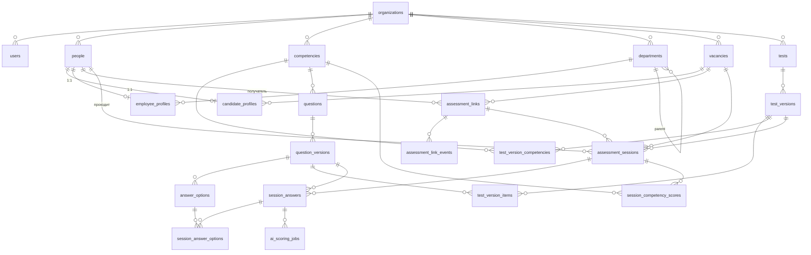

# Структура базы данных — Eltera (оценка персонала)

Полная схема БД сервиса оценки персонала. Документ описывает домен, все таблицы,
их связи, перечисления и принятые архитектурные решения.

> Стек: PostgreSQL + асинхронный SQLAlchemy 2.0 + Alembic.
> Первый этап реализации — вкладка **«Кандидаты»**, но схема покрывает и сотрудников.

---

## 1. Суть сервиса и поток данных

Сервис оценивает **профессиональные навыки** людей по тестам, привязанным к вакансии/роли.

```
Вакансия ──> Тест (профиль) ──┐
                              │  создаётся ссылка-приглашение (token)
Кандидат/Сотрудник <──────────┘
   │
   │ переходит по ссылке
   ▼
Прохождение теста (assessment_session)
   │  отвечает на вопросы (закрытые/множественные/открытые/шкала)
   ▼
Скоринг:
   • закрытые/шкала — баллы по вариантам сразу
   • открытые       — AI-оценка (асинхронно)
   ▼
Результат: % соответствия, red flags, рекомендация, баллы по компетенциям
   │
   ▼
Карточка кандидата/сотрудника + дашборд + воронка
```

Ключевые принципы (по согласованным решениям):

1. **Единая личность.** Человек хранится один раз в `people`; «кандидат» и «сотрудник» —
   это профили-расширения 1:1 (`candidate_profiles`, `employee_profiles`). Кандидат при
   приёме просто получает `employee_profile`, история оценок сохраняется.
2. **Версионирование.** Тесты и вопросы **неизменяемы после публикации**: правка создаёт
   новую версию. Каждая сессия/результат привязаны к конкретной версии теста — прошлые
   отчёты не «плывут» при редактировании.
3. **4 типа вопросов:** одиночный выбор, множественный выбор, открытый ответ, шкала (Likert).
4. **AI-оценка** открытых ответов выполняется отдельным слоем задач (`ai_scoring_jobs`),
   результат пишется в ответ сессии.

---

## 2. Слои и таблицы

| Слой | Таблицы |
|---|---|
| Организация / доступ | `organizations`, `users` |
| Справочники          | `competencies`, `departments`, `vacancies` |
| Конструктор тестов   | `tests`, `test_versions`, `test_version_competencies`, `questions`, `question_versions`, `answer_options`, `test_version_items` |
| Люди                 | `people`, `candidate_profiles`, `employee_profiles` |
| Приглашения          | `assessment_links`, `assessment_link_events` |
| Прохождение и оценка | `assessment_sessions`, `session_answers`, `session_answer_options`, `session_competency_scores` |
| AI-скоринг           | `ai_scoring_jobs` |

---

## 3. ER-диаграмма



---

## 4. Описание таблиц

Обозначения: **PK** — первичный ключ, **FK** — внешний ключ, `?` — nullable.
ID везде — `UUID` (в PostgreSQL — нативный `uuid`; в SQLite хранится как 32-симв. hex).

### 4.1 Организация и доступ

#### `organizations` — компания-клиент (мультитенантность)
| Поле | Тип | Описание |
|---|---|---|
| id | UUID **PK** | |
| name | str | Название |
| inn, kpp | str? | Реквизиты |
| tariff | str | Тариф (Start/TalentPro/…) |
| created_at, updated_at | datetime | |

#### `users` — сотрудники платформы (рекрутеры/руководители/админы)
| Поле | Тип | Описание |
|---|---|---|
| id | UUID **PK** | |
| organization_id | UUID **FK** → organizations | |
| email | str unique | Логин |
| full_name | str | |
| role | enum `user_role` | admin / recruiter / manager |
| password_hash | str | |
| is_active | bool | |
| created_at | datetime | |

> На `users` ссылаются поля «ответственный», `created_by`, `reviewed_by`.

### 4.2 Справочники

#### `competencies` — компетенции (общие и профессиональные)
| Поле | Тип | Описание |
|---|---|---|
| id | UUID **PK** | |
| organization_id | UUID? **FK** | NULL = системная/глобальная |
| key | str | Машинный ключ (`responsibility`, `mass_recruiting`) |
| title | str | «Ответственность», «Массовый подбор» |
| description | text? | |
| kind | enum `competency_kind` | common / professional |
| created_at | datetime | |

#### `departments` — отделы (для сотрудников и оргструктуры)
| Поле | Тип | Описание |
|---|---|---|
| id | UUID **PK** | |
| organization_id | UUID **FK** | |
| name | str | |
| head_person_id | UUID? **FK** → people | Руководитель |
| parent_department_id | UUID? **FK** → departments | Иерархия |

#### `vacancies` — вакансии
| Поле | Тип | Описание |
|---|---|---|
| id | UUID **PK** | |
| organization_id | UUID **FK** | |
| title | str | |
| external_id | str? | id во внешней системе (hh_349012) |
| source | str? | hh.ru / SuperJob / API / ручная |
| url | str? | |
| city | str? | |
| salary | str? | |
| selection_type | str? | Точечный / Массовый / IT… |
| status | enum `vacancy_status` | active / draft / closed |
| default_test_id | UUID? **FK** → tests | Тест по умолчанию для вакансии |
| published_at | date? | |
| created_at | datetime | |

### 4.3 Конструктор тестов (с версионированием)

#### `tests` — логический тест/профиль (стабильная сущность)
| Поле | Тип | Описание |
|---|---|---|
| id | UUID **PK** | |
| organization_id | UUID? **FK** | NULL = системный (фиксированный) тест |
| key | str? | Слаг (`sales_manager`) |
| title | str | «Менеджер по продажам» |
| category | str? | HR / Коммерция / Сервис… |
| target_type | enum `test_target` | candidate / employee / group |
| summary | text? | |
| is_system | bool | Встроенный (нередактируемый базово) |
| current_version_id | UUID? **FK** → test_versions | Активная опубликованная версия |
| created_at, updated_at | datetime | |

#### `test_versions` — неизменяемая версия теста
| Поле | Тип | Описание |
|---|---|---|
| id | UUID **PK** | |
| test_id | UUID **FK** → tests | |
| version_no | int | 1, 2, 3… |
| status | enum `version_status` | draft / published / archived |
| notes | text? | Что изменилось |
| created_by | UUID? **FK** → users | |
| published_at | datetime? | |
| created_at | datetime | |

> *Уникальность:* (`test_id`, `version_no`). Состав версии (вопросы) задаётся в `test_version_items`.

#### `test_version_competencies` — компетенции версии теста (M:N + вес)
| Поле | Тип | Описание |
|---|---|---|
| id | UUID **PK** | |
| test_version_id | UUID **FK** → test_versions | |
| competency_id | UUID **FK** → competencies | |
| weight | float | Вес компетенции в итоге (по умолчанию 1.0) |

#### `questions` — логический вопрос (банк вопросов)
| Поле | Тип | Описание |
|---|---|---|
| id | UUID **PK** | |
| organization_id | UUID? **FK** | NULL = системный |
| competency_id | UUID **FK** → competencies | Что проверяет |
| scope | enum `question_scope` | common / professional |
| is_system | bool | Фиксированный вопрос |
| created_at | datetime | |

#### `question_versions` — неизменяемое содержимое вопроса
| Поле | Тип | Описание |
|---|---|---|
| id | UUID **PK** | |
| question_id | UUID **FK** → questions | |
| version_no | int | |
| type | enum `question_type` | single_choice / multiple_choice / open / scale |
| text | text | Формулировка |
| status | enum `version_status` | draft / published / archived |
| max_score | int | Максимум баллов за вопрос |
| **— для шкалы —** | | |
| scale_min, scale_max | int? | Границы (1..5) |
| **— для открытых (AI) —** | | |
| ai_reference | text? | Эталонный ответ |
| ai_criteria | text? | Критерии оценки для модели |
| created_at | datetime | |

> Уникальность: (`question_id`, `version_no`). Варианты ответов версионируются вместе с текстом.

#### `answer_options` — вариант ответа (для closed/scale)
| Поле | Тип | Описание |
|---|---|---|
| id | UUID **PK** | |
| question_version_id | UUID **FK** → question_versions | |
| text | str | |
| score | int | Балл за выбор |
| is_red_flag | bool | Красный флаг |
| is_correct | bool | Пометка «правильный» |
| scale_value | int? | Для шкалы — числовое значение точки |
| sort_order | int | Порядок |

#### `test_version_items` — состав версии теста (упорядоченный список вопросов)
| Поле | Тип | Описание |
|---|---|---|
| id | UUID **PK** | |
| test_version_id | UUID **FK** → test_versions | |
| question_version_id | UUID **FK** → question_versions | Конкретная версия вопроса |
| sort_order | int | Порядок в тесте |
| weight | float | Вес вопроса (по умолчанию 1.0) |

> Связь версии теста именно с **версиями вопросов** гарантирует: результат, привязанный
> к `test_version_id`, всегда соответствует точному тексту и баллам на момент прохождения.

### 4.4 Люди

#### `people` — личность (единая для кандидата и сотрудника)
| Поле | Тип | Описание |
|---|---|---|
| id | UUID **PK** | |
| organization_id | UUID **FK** → organizations | |
| last_name, first_name, patronymic | str? | |
| full_name | str | Денормализованное ФИО (поиск/вывод) |
| email | str? | |
| phone | str? | |
| city | str? | |
| created_at, updated_at | datetime | |

#### `candidate_profiles` — профиль кандидата (1:1 к people)
| Поле | Тип | Описание |
|---|---|---|
| person_id | UUID **PK, FK** → people | 1:1 |
| vacancy_id | UUID? **FK** → vacancies | На какую вакансию |
| source | str? | Источник входа |
| selection_type | str? | Тип подбора |
| stage | enum `candidate_stage` | Этап воронки |
| responsible_user_id | UUID? **FK** → users | Ответственный рекрутер |
| applied_at | datetime? | |
| notes | text? | |

#### `employee_profiles` — профиль сотрудника (1:1 к people)
| Поле | Тип | Описание |
|---|---|---|
| person_id | UUID **PK, FK** → people | 1:1 |
| department_id | UUID? **FK** → departments | |
| position | str? | Должность |
| manager_id | UUID? **FK** → people | Руководитель |
| project | str? | |
| start_date | date? | |
| employment_type | str? | офисный / линейный / руководитель |
| turnover_risk | enum `risk_level` | низкий / средний / повышенный |
| burnout | str? | нет / есть признаки / выгорание |
| satisfaction | int? | % удовлетворённости |
| recommendation | text? | |

### 4.5 Приглашения

#### `assessment_links` — ссылка-приглашение на тест
| Поле | Тип | Описание |
|---|---|---|
| id | UUID **PK** | |
| organization_id | UUID **FK** | |
| token | str unique | Токен в URL `/assess/{token}` |
| test_id | UUID **FK** → tests | Какой тест |
| test_version_id | UUID **FK** → test_versions | Какая версия выдаётся |
| person_id | UUID? **FK** → people | Получатель (если уже создан) |
| recipient_type | enum `respondent_type` | candidate / employee |
| recipient_email, recipient_phone | str? | Если человек ещё не заведён |
| vacancy_id | UUID? **FK** → vacancies | |
| status | enum `link_status` | pending / sent / opened / in_progress / completed / expired / cancelled |
| expires_at | datetime? | |
| created_by | UUID? **FK** → users | |
| created_at | datetime | |

#### `assessment_link_events` — история ссылки
| Поле | Тип | Описание |
|---|---|---|
| id | UUID **PK** | |
| link_id | UUID **FK** → assessment_links | |
| event | str | created / sent / opened / completed… |
| meta | JSON? | Доп. данные |
| created_at | datetime | |

### 4.6 Прохождение и результат

#### `assessment_sessions` — прохождение теста (ядро)
| Поле | Тип | Описание |
|---|---|---|
| id | UUID **PK** | |
| organization_id | UUID **FK** | |
| person_id | UUID **FK** → people | Кто проходит |
| link_id | UUID? **FK** → assessment_links | Откуда (может быть без ссылки) |
| test_id | UUID **FK** → tests | |
| test_version_id | UUID **FK** → test_versions | Версия, которую проходил |
| respondent_type | enum `respondent_type` | candidate / employee |
| vacancy_id | UUID? **FK** → vacancies | |
| status | enum `session_status` | in_progress / submitted / scoring / scored / reviewed |
| **— агрегированный результат —** | | |
| score | int | Набрано баллов |
| max_score | int | Максимум |
| percent | int | % соответствия |
| red_flags | int | Кол-во красных флагов |
| unanswered_count | int | Без ответа |
| recommendation_level | enum `recommendation_level` | not_recommended / reserve / conditional / recommended |
| recommendation_text | text? | Человекочитаемая рекомендация |
| started_at, submitted_at, scored_at | datetime? | |
| created_at | datetime | |

#### `session_answers` — ответ на конкретный вопрос
| Поле | Тип | Описание |
|---|---|---|
| id | UUID **PK** | |
| session_id | UUID **FK** → assessment_sessions | |
| question_version_id | UUID **FK** → question_versions | На какую версию вопроса |
| answer_text | text? | Открытый ответ (свободный текст) |
| scale_value | int? | Значение для шкалы |
| awarded_score | int | Итоговый балл (авто/AI/проверка) |
| is_red_flag | bool | Сработал red flag |
| ai_status | enum `ai_status` | not_required / pending / scored / failed |
| ai_score | int? | Балл от модели (открытые) |
| ai_rationale | text? | Обоснование модели |
| reviewed_score | int? | Балл после ручной коррекции |
| reviewed_by | UUID? **FK** → users | |
| answered_at | datetime? | |

#### `session_answer_options` — выбранные варианты (для single/multiple/scale)
| Поле | Тип | Описание |
|---|---|---|
| id | UUID **PK** | |
| session_answer_id | UUID **FK** → session_answers | |
| answer_option_id | UUID **FK** → answer_options | Выбранный вариант |

> Один ряд для single_choice, несколько — для multiple_choice. Открытый ответ рядов не имеет
> (хранится в `session_answers.answer_text`).

#### `session_competency_scores` — баллы по компетенциям за сессию
| Поле | Тип | Описание |
|---|---|---|
| id | UUID **PK** | |
| session_id | UUID **FK** → assessment_sessions | |
| competency_id | UUID **FK** → competencies | |
| score | int | |
| max_score | int | |
| percent | int | |

### 4.7 AI-скоринг

#### `ai_scoring_jobs` — задача оценки открытого ответа моделью
| Поле | Тип | Описание |
|---|---|---|
| id | UUID **PK** | |
| session_answer_id | UUID **FK** → session_answers | |
| status | enum `ai_job_status` | queued / running / done / error |
| model | str? | Название модели |
| prompt | text? | Отправленный запрос |
| raw_response | text? | Сырой ответ |
| score | int? | Извлечённый балл |
| rationale | text? | Обоснование |
| error | text? | |
| created_at, finished_at | datetime? | |

---

## 5. Перечисления (enums)

| Enum | Значения |
|---|---|
| `user_role` | admin, recruiter, manager |
| `competency_kind` | common, professional |
| `question_scope` | common, professional |
| `question_type` | single_choice, multiple_choice, open, scale |
| `test_target` | candidate, employee, group |
| `version_status` | draft, published, archived |
| `vacancy_status` | active, draft, closed |
| `respondent_type` | candidate, employee |
| `candidate_stage` | new, assessment_sent, in_progress, interview, fit, conditional, not_fit, accepted, stuck |
| `risk_level` | low, medium, high |
| `link_status` | pending, sent, opened, in_progress, completed, expired, cancelled |
| `session_status` | in_progress, submitted, scoring, scored, reviewed |
| `recommendation_level` | not_recommended, reserve, conditional, recommended |
| `ai_status` | not_required, pending, scored, failed |
| `ai_job_status` | queued, running, done, error |

> Пороги (из фронтенда `scoring.js`): `percent ≥ 82` → recommended, `≥ 68` → conditional,
> `≥ 52` → reserve, иначе not_recommended; при `red_flags ≥ 2` уровень понижается на 1.

---

## 6. Логика скоринга

1. **Закрытые / шкала:** при отправке сессии для каждого `session_answer` берётся `score`
   выбранного `answer_option` (или сумма для multiple_choice). `max_score` вопроса —
   максимум из вариантов. Сразу считаются агрегаты и `session_competency_scores`.
2. **Открытые:** создаётся `ai_scoring_jobs` (status=queued). Воркер вызывает модель
   с `ai_reference`/`ai_criteria`, пишет `ai_score`+`ai_rationale` в `session_answers`,
   `ai_status=scored`. После оценки всех открытых пересчитываются агрегаты сессии.
3. **Ручная коррекция (опционально):** `reviewed_score` перекрывает авто/AI-балл.
4. **Итог:** `percent = score / max_score * 100`, `recommendation_level` по порогам выше.

---

## 7. Соответствие данным фронтенда

| Фронтенд | Таблица(ы) БД |
|---|---|
| `commonCompetencies`, `professionalCompetencies` | `competencies` (kind) |
| `professions` | `tests` + `test_versions` (+ `test_version_competencies`) |
| `questions[]` (`scope`, `competencyId`, `text`) | `questions` + `question_versions` |
| `answer(text, score, redFlag)` | `answer_options` |
| `buildAssessment()` (common + профессия) | `test_version_items` |
| `createLinkObject()` / `links[]` | `assessment_links` (+ `assessment_link_events`) |
| `demoSession()` / `sessions[]` | `assessment_sessions` + `session_answers` |
| `result.competencyScores` | `session_competency_scores` |
| Кандидат (person.* + vacancy/source/stage) | `people` + `candidate_profiles` |
| Сотрудник (seedEmployees) | `people` + `employee_profiles` |
| `departments` | `departments` |
| `vacancies` | `vacancies` |
| «Ответственный: Рекрутер» | `users` |

---

## 8. План реализации (этапами)

1. **Этап 1 (текущий) — «Кандидаты».** Таблицы: `organizations`, `users`, `people`,
   `candidate_profiles`, `vacancies`, `competencies`, `tests`, `test_versions`,
   `questions`, `question_versions`, `answer_options`, `test_version_items`,
   `assessment_links`, `assessment_link_events`, `assessment_sessions`, `session_answers`,
   `session_answer_options`, `session_competency_scores`, `ai_scoring_jobs`.
   > Существующие в backend таблицы `candidates`/`competency_scores` (этап MVP) будут
   > перенесены в эту модель: `candidates → people + candidate_profiles + assessment_sessions`.
2. **Этап 2 — «Сотрудники».** Добавляется `employee_profiles`, `departments` уже есть.
   Сессии и скоринг переиспользуются (`target_type=employee`).
3. **Этап 3 — групповые оценки / 360.** `test_target=group`, шкальные вопросы.

> Не входит в схему данных оценки (отдельные модули при необходимости): тарифы, биллинг,
> реферальная программа, API-ключи.
